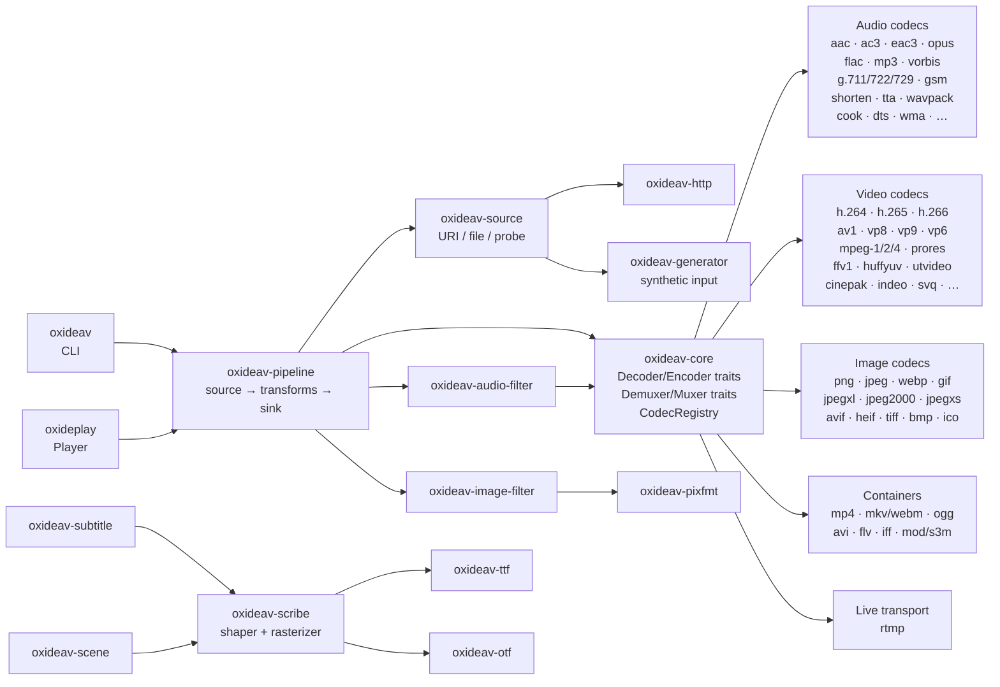

# OxideAV

**Pure-Rust media transcoding and streaming.** No C libraries, no FFI
wrappers, no `*-sys` crates — every codec, container, and filter is
implemented from the spec in safe Rust.

## Get started

The two user-facing binaries:

### `oxideav` — the CLI

Probe, remux, transcode, run JSON transcode graphs. Drop-in on servers
and pipelines; one static binary, no system deps.

```sh
cargo install oxideav-cli
```

…or grab a pre-built binary from the latest
[oxideav-workspace release](https://github.com/OxideAV/oxideav-workspace/releases).

```sh
oxideav list                            # registered codecs + containers
oxideav probe video.mp4                 # demux probe + metadata
oxideav transcode song.flac song.wav    # remux or transcode
oxideav run job.json                    # run a JSON transcode graph
```

### `oxideplay` — the reference player

SDL2 + TUI frontend. SDL2 is loaded **at runtime via libloading**, so
the binary builds + ships without an SDL2 build-time dep (install SDL2
on the target machine; oxideplay falls back gracefully if it's
missing).

```sh
cargo install oxideplay
```

…or grab it pre-built from the same
[oxideav-workspace release archive](https://github.com/OxideAV/oxideav-workspace/releases).

```sh
oxideplay path/to/file.mkv
oxideplay https://example.com/video.mp4
oxideplay --job job.json            # render a transcode graph live
```

**Pre-built releases** bundle both binaries (`oxideav` + `oxideplay`)
in one per-platform archive — Linux x86_64, macOS universal (Intel +
Apple Silicon), Windows x86_64 — published as a single GitHub Release
per workspace tag.

---

## Architecture



`oxideav-core` carries the trait surface (`Decoder`, `Encoder`,
`Demuxer`, `Muxer`) plus the registry. Every codec/container crate
registers itself at module init; the pipeline executor only sees the
registry, never any concrete crate.

---

## Using it as a library

OxideAV is a modular framework shipped as ~95 small crates. Each codec
is its own repository and its own crates.io release, so you pick only
what you need and their cadence stays independent of the framework.

Single-crate standalone use is the expected case:

```toml
[dependencies]
oxideav-core = "0.1"       # types + Decoder/Encoder traits + registry
oxideav-g711 = "0.0"       # or any other codec
```

```rust
use oxideav_core::{
    CodecId, CodecParameters, CodecRegistry, Frame, Packet, TimeBase,
};

let mut reg = CodecRegistry::new();
oxideav_g711::register(&mut reg);

let mut params = CodecParameters::audio(CodecId::new("pcm_mulaw"));
params.sample_rate = Some(8_000);
params.channels = Some(1);

let mut dec = reg.make_decoder(&params)?;
dec.send_packet(&Packet::new(0, TimeBase::new(1, 8_000), ulaw_bytes))?;
let Frame::Audio(a) = dec.receive_frame()? else { unreachable!() };
```

Or use the aggregator (`oxideav`) to pull everything in one shot:

```toml
[dependencies]
oxideav = "0.0"
```

---

## Infrastructure crates

| Crate | Role |
|---|---|
| [`oxideav-core`](https://github.com/OxideAV/oxideav-core) | `Packet` / `Frame` / `TimeBase` / `PixelFormat` / `Error` + `Decoder`/`Encoder`/`Demuxer`/`Muxer` traits + `CodecRegistry` |
| [`oxideav-pipeline`](https://github.com/OxideAV/oxideav-pipeline) | Source → transforms → sink composition + JSON transcode graph + multithreaded executor |
| [`oxideav-source`](https://github.com/OxideAV/oxideav-source) | URI resolution, file reader, `BufferedSource` prefetch ring |
| [`oxideav-http`](https://github.com/OxideAV/oxideav-http) | HTTP(S) source driver (ureq + rustls) |
| [`oxideav-generator`](https://github.com/OxideAV/oxideav-generator) | Synthetic media source (`generate://`, `xc:`, `pattern:`, `gradient:`, `testsrc:`, …) |
| [`oxideav-pixfmt`](https://github.com/OxideAV/oxideav-pixfmt) | Pixel-format conversion, palette quantisation, dither, alpha blending |
| [`oxideav-audio-filter`](https://github.com/OxideAV/oxideav-audio-filter) | Volume / NoiseGate / Echo / Resample / Spectrogram |
| [`oxideav-image-filter`](https://github.com/OxideAV/oxideav-image-filter) | Resize / crop / rotate / colour / overlay |
| [`oxideav-id3`](https://github.com/OxideAV/oxideav-id3) | ID3v1 / v2.2 / v2.3 / v2.4 tag parser |
| [`oxideav-rtmp`](https://github.com/OxideAV/oxideav-rtmp) | RTMP live-streaming source |
| [`oxideav-ttf`](https://github.com/OxideAV/oxideav-ttf) | TrueType parser (cmap, GSUB, GPOS, kerning, ligatures) |
| [`oxideav-otf`](https://github.com/OxideAV/oxideav-otf) | OpenType-CFF parser (Type 2 charstrings) |
| [`oxideav-scribe`](https://github.com/OxideAV/oxideav-scribe) | Font rasterizer + shaper + line layout (Latin / CJK + GSUB / GPOS) |
| [`oxideav-scene`](https://github.com/OxideAV/oxideav-scene) | Time-based scene / composition model (PDF pages, NLE timelines) |

## Format coverage

**Containers** — MP4 · Matroska / WebM · Ogg · AVI · FLV · IFF / 8SVX · MOD · S3M · RTMP (live source)

**Audio codecs** — PCM · ADPCM · AAC-LC (with ADTS + LATM/LOAS) · MP1 · MP2 · MP3 · FLAC · Vorbis · Opus · CELT · Speex · GSM · G.711 · G.722 · G.723.1 · G.728 · G.729 · iLBC · AC-3 · E-AC-3 · AC-4 · DTS (Core / EXSS / XCH / XXCH / X96 / XLL) · WMA (v1 / v2 / Pro / Lossless) · Cook · Musepack · WavPack · Shorten · TTA · aptX · MIDI (SMF)

**Video codecs** — H.261 · H.263 · H.264 (decode + CABAC encode, High10) · H.265 (decode + 4:4:4 12-bit IDR encode) · H.266 · MPEG-1 · MPEG-2 · MPEG-4 P2 · MS-MPEG-4 · MJPEG (with progressive + arithmetic SOF9) · Theora · Dirac (with OBMC encode) · ProRes (RDD 36 — all 6 profiles) · FFV1 · AV1 (decode) · VP6 · VP8 · VP9 · AMV · HuffYUV · Lagarith · Ut Video · MagicYUV · Cinepak · Sorenson SVQ1 · Indeo (v2 + v3/v4/v5 module-ready) · EVC

**Image codecs** — PNG / APNG · GIF · WebP (lossy + lossless + animated) · JPEG (via MJPEG, baseline + progressive + arithmetic) · JPEG XL (decoder) · JPEG 2000 · JPEG XS · AVIF (decoder) · HEIF / HEIC (via H.265 — clap / irot / imir / iovl / grid / auxC) · TIFF · BMP · ICO

**Subtitles** — SRT · WebVTT · ASS / SSA · TTML · SAMI · MicroDVD · MPL2 · MPsub · VPlayer · PJS · AQTitle · JACOsub · RealText · SubViewer 1/2 · EBU STL · PGS · DVB · VobSub

Each crate ships its own corpus + trace harness against an external
reference (ffmpeg / cwebp / libpng / TurboJPEG / etc.) plus a
`cargo-fuzz` harness for the fully-functional encode + decode paths.

---

## Contributing

Clone [`oxideav-workspace`](https://github.com/OxideAV/oxideav-workspace)
plus any sibling crate you want to hack on, then run
`scripts/dev-patch.sh`. The generated `.cargo/config.toml` wires every
local sibling into the workspace via `[patch.crates-io]`, so
`cargo run -p oxideplay` picks up your local edits without a
re-publish.

## Reusable CI workflows

Three GitHub Actions reusable workflows live in this repo and are
shared by every sibling crate so we don't have to keep ~95 copies of
the same YAML in sync:

* **`crate-ci.yml`** — `cargo build --all-targets` + `cargo test` on
  the OS matrix (Linux + macOS + Windows by default), `cargo fmt
  --check`, `cargo clippy --no-deps -- -D warnings`, and an optional
  miri job (rate-limited to once-a-day per repo).
* **`crate-fuzz.yml`** — daily nightly `cargo-fuzz` run for crates
  that ship harnesses under `fuzz/`. Auto-discovers targets from
  `fuzz/fuzz_targets/*.rs`, splits the per-day budget across them,
  and persists the corpus across runs.
* **`crate-release.yml`** — wraps
  [release-plz](https://release-plz.dev): opens/refreshes the release
  PR on every push to `master`, then publishes to crates.io + tags
  the GitHub Release once that PR is merged.

We are still in heavy development, so callers should track `@master`
(no pinned version yet — there's no `v1` tag).

### Opting in (sibling crate)

Replace the crate's `.github/workflows/ci.yml` with:

```yaml
name: CI
on:
  push: { branches: [master] }
  pull_request: { branches: [master] }
jobs:
  ci:
    uses: OxideAV/.github/.github/workflows/crate-ci.yml@master
    with:
      enable_miri: false
    secrets: inherit
```

…and the crate's `.github/workflows/release-plz.yml` with:

```yaml
name: Release-plz
on:
  push: { branches: [master] }

# Caller must grant the permissions the reusable workflow needs —
# workflow_call does NOT elevate the calling token.
permissions:
  contents: write
  pull-requests: write

jobs:
  release:
    uses: OxideAV/.github/.github/workflows/crate-release.yml@master
    secrets: inherit
```

Optional: add `.github/workflows/fuzz.yml` for nightly fuzz runs:

```yaml
name: Fuzz
on:
  schedule:
    - cron: "37 4 * * *"   # daily 04:37 UTC, jittered off the hour
  workflow_dispatch:
jobs:
  fuzz:
    uses: OxideAV/.github/.github/workflows/crate-fuzz.yml@master
    with:
      extra_packages_apt: "libwebp-dev"   # whatever the harness dlopens
      time_budget_seconds: 1800
    secrets: inherit
```

### `crate-ci.yml` inputs

| Input             | Type    | Default                                           | Purpose                                                  |
|-------------------|---------|---------------------------------------------------|----------------------------------------------------------|
| `enable_miri`     | bool    | `false`                                           | Add a miri job on nightly with `-Zmiri-strict-provenance -Zmiri-disable-isolation`. |
| `extra_test_args` | string  | `""`                                              | Appended verbatim to `cargo test` (e.g. `--features foo`). |
| `rust_toolchain`  | string  | `"stable"`                                        | Toolchain channel for the test job.                      |
| `os_matrix`       | string  | `'["ubuntu-latest", "macos-latest", "windows-latest"]'` | JSON array of runner OSes. Override e.g. to drop Windows. |

### `crate-fuzz.yml` inputs

| Input                  | Type    | Default | Purpose                                                                                  |
|------------------------|---------|---------|------------------------------------------------------------------------------------------|
| `time_budget_seconds`  | number  | `1800`  | Total fuzz time across all targets (each target gets `time_budget / num_targets`).       |
| `targets`              | string  | `""`    | Comma-separated fuzz target names. Empty = auto-discover from `fuzz/fuzz_targets/*.rs`.  |
| `extra_packages_apt`   | string  | `""`    | Space-separated apt packages to install before fuzzing (`libwebp-dev libpng-dev` …).     |
| `extra_packages_brew`  | string  | `""`    | Space-separated brew packages (only used when `os` contains `macos`).                    |
| `os`                   | string  | `"ubuntu-latest"` | Runner OS. Fuzz is Linux-friendly; macOS is supported but rarely needed.       |
| `sanitizer`            | string  | `"address"` | libfuzzer sanitizer: `address` / `none` / `memory` / `thread`.                       |

### `crate-release.yml` inputs

| Input            | Type   | Default    | Purpose                                              |
|------------------|--------|------------|------------------------------------------------------|
| `rust_toolchain` | string | `"stable"` | Toolchain installed before `release-plz` runs.       |

### Required secrets (forwarded with `secrets: inherit`)

* `CARGO_REGISTRY_TOKEN` — crates.io publish token (release workflow).
* `RELEASE_PLZ_TOKEN` (optional) — PAT used so the tag push triggers
  downstream workflows; falls back to `GITHUB_TOKEN`.

## License

Every crate is MIT-licensed. Copyright © 2026 Karpelès Lab Inc.
